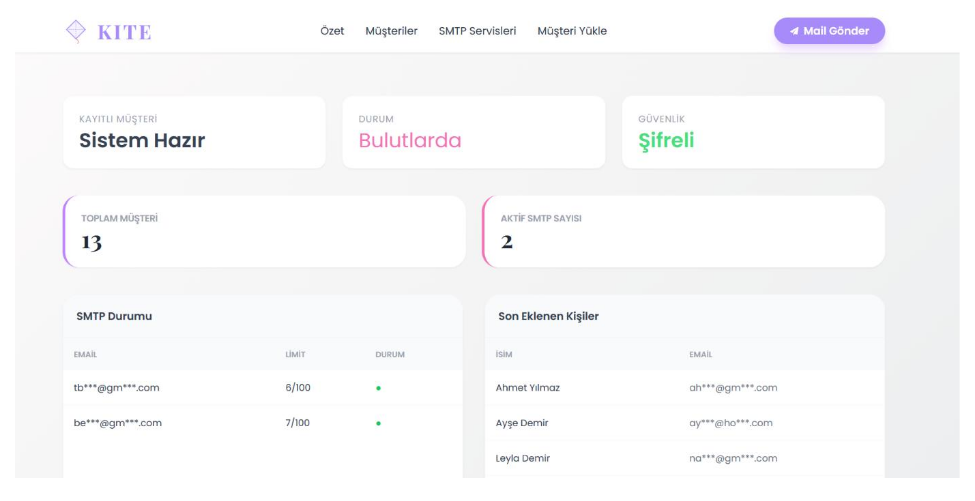
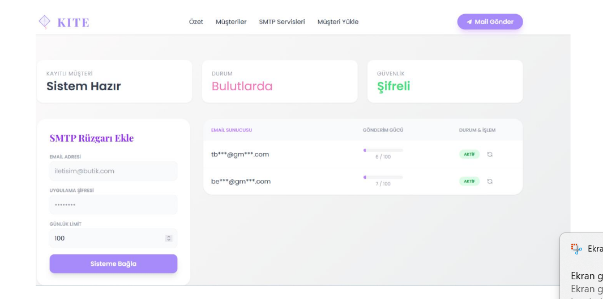
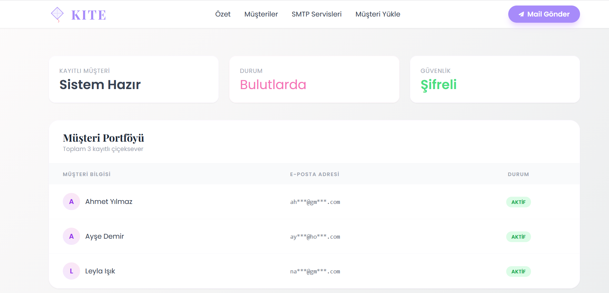
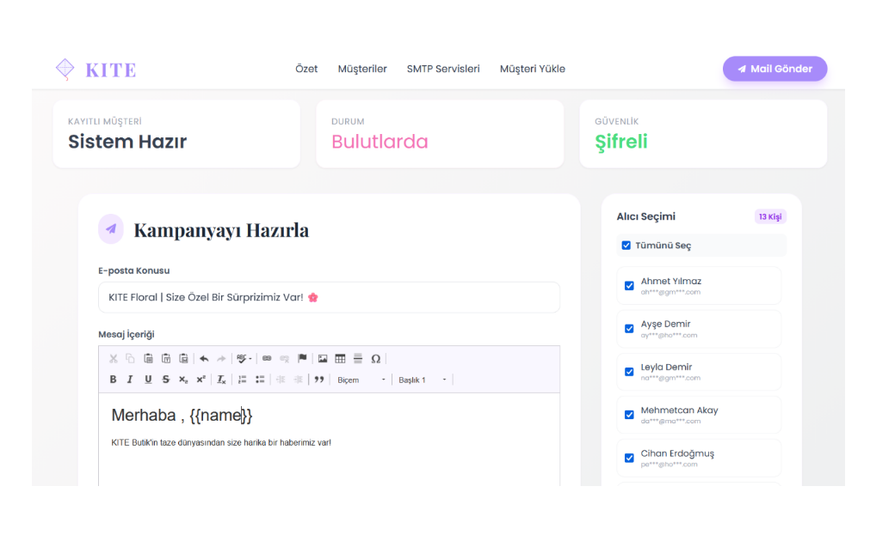
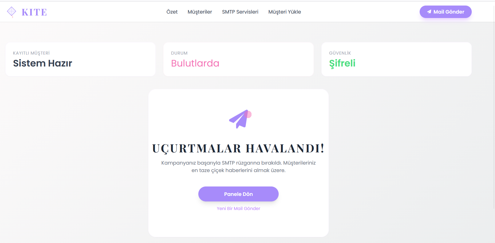

# KITE Mailer

**Proje Türü:** SMTP Tabanlı Toplu E-Posta Gönderim Web Uygulaması  

---

## Proje Açıklaması
KITE Mailer, küçük bir butik çiçek/hediyelik eşya dükkanı için tasarlanmış bir web uygulamasıdır.  
Uygulama, birden fazla SMTP hesabını kullanarak müşterilere toplu veya kişiye özel e-postalar göndermeyi sağlar.  
Amacı, yüzlerce müşteriye kişiselleştirilmiş e-posta kampanyalarını güvenli ve düzenli bir şekilde iletmektir.

---

## Kullanılan Teknolojiler
- **Python 3 + Flask** – Web uygulaması altyapısı  
- **SQLite** – Veritabanı  
- **SMTP Protokolü** – Mail gönderimi  
- **HTML / CSS (Tailwind)** – Arayüz tasarımı  
- **Jinja2** – Template motoru  
- **Fernet (cryptography)** – E-posta şifreleme  

---

## Özellikler

### 1. Dashboard
- Toplam müşteri sayısı ve aktif SMTP hesaplarının durumu görüntülenir.  
- Gönderilen mail sayıları ve günlük limitler özet olarak gösterilir.  



---

### 2. SMTP Yönetimi
- SMTP hesaplarını ekleyebilir, silebilir veya günlük limitlerini sıfırlayabilirsiniz.  
- Hesaplar grafik ve tablo ile gösterilir, limit dolduğunda otomatik dağıtım yapılır.  



---

### 3. Müşteri Portföyü
- Sistemde kayıtlı tüm müşteriler listelenir.  



---

### 4.CSV ile Müşteri Ekleme

Çok sayıda müşteri CSV dosyası aracılığıyla eklenebilir.
[Customer ](screenshots/import-csv.png)

---

### 5. Mail Gönderimi
- Kişiye özel veya toplu e-posta gönderimi yapılabilir.  
- Mail içeriği HTML olarak hazırlanabilir ve önizleme yapılabilir.  
- Uygulama, uygun SMTP hesabını otomatik seçerek gönderimi dengeli dağıtır.  



---

### 6. Başarılı Gönderim (Success Screen)


---


## Kurulum ve Kullanım

1. Projeyi klonlayın:
```bash
git clone https://github.com/LadyBeta/flask-mailer.git
cd flask-mailer/KITE

2.Sanal ortam oluşturun ve aktif edin:
python -m venv venv

#Windows:
venv\Scripts\activate

#Linux / macOS:
source venv/bin/activate


3.Gerekli paketleri yükleyin:
pip install -r requirements.txt


4.Uygulamayı başlatın:
python app.py

5.Tarayıcıdan aşağıdaki adrese gidin:
http://127.0.0.1:5000/dashboard
